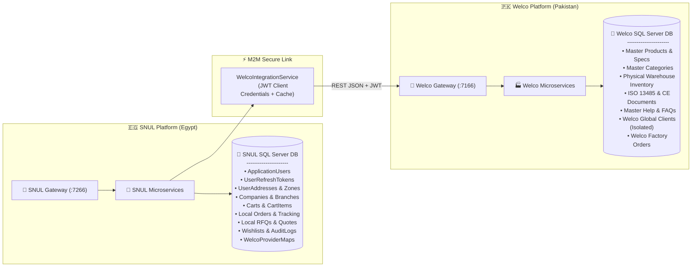
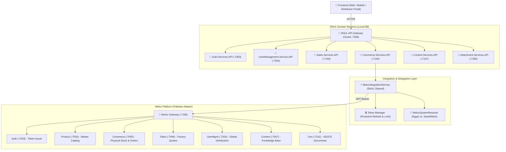
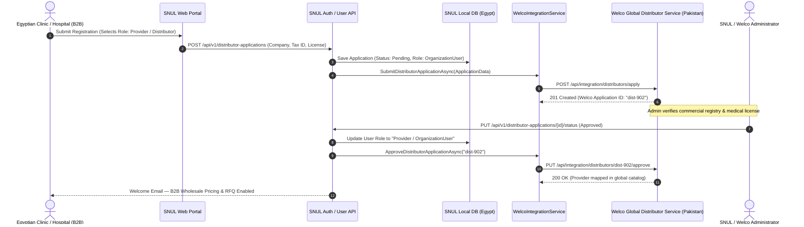
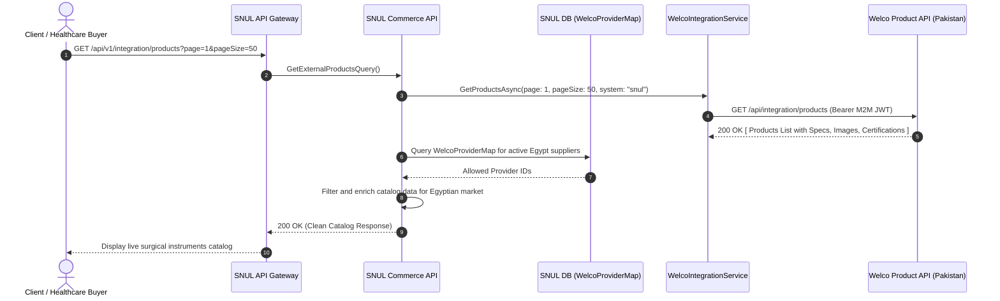
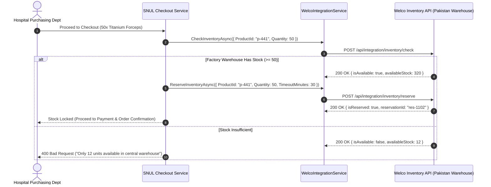
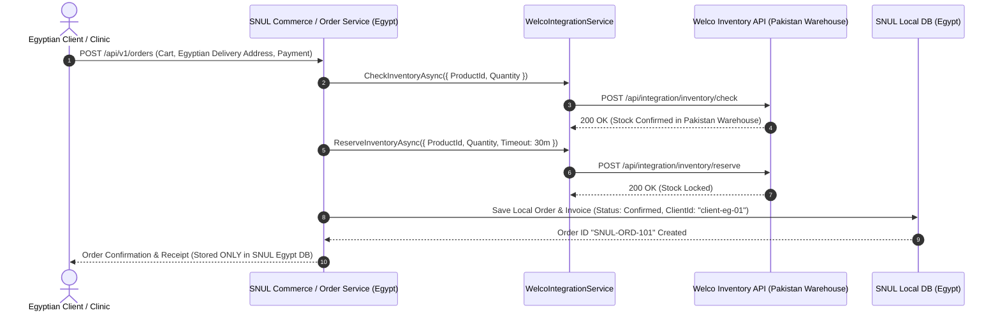
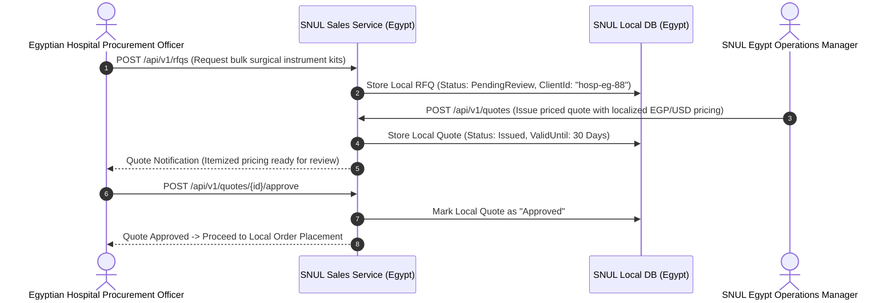
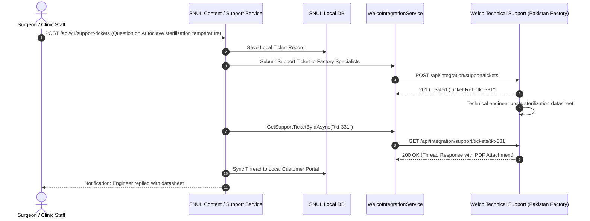

# 🏥 SNUL — Medical & Surgical Commerce Platform (Egypt & Regional Hub)

> **Enterprise B2B & B2C healthcare distribution backend for surgical instruments and medical devices.**
> 
> Sourced directly from **Welco Surgical Instruments Platform** (Pakistan Manufacturing & Master Inventory Source) and operating with **strictly isolated client databases and regional distribution architecture**.
> 
> Built on **.NET 10**, **Clean / Onion Architecture**, **CQRS (MediatR)**, and **Ocelot API Gateway**.

---

## 📑 Table of Contents

- [🌍 Business & Geographic Architecture](#-business--geographic-architecture)
- [👥 Role Hierarchy & Entity Equivalence](#-role-hierarchy--entity-equivalence)
- [🛡️ Data Isolation & Architecture Boundary](#️-data-isolation--architecture-boundary)
- [🏗️ System Architecture & Distributed Topology](#️-system-architecture--distributed-topology)
- [🔌 Microservices Decomposition](#-microservices-decomposition)
- [📡 API Endpoints: Shared vs. Isolated Breakdown](#-api-endpoints-shared-vs-isolated-breakdown)
  - [A. Shared Presentational Endpoints (Sourced from Welco Master)](#a-shared-presentational-endpoints-sourced-from-welco-master)
  - [B. Isolated Client & Transactional Endpoints (SNUL Egypt DB Only)](#b-isolated-client--transactional-endpoints-snul-egypt-db-only)
- [🔄 Core Business Workflows & Sequence Diagrams](#-core-business-workflows--sequence-diagrams)
  - [Workflow 1: Client Distributor/Provider Onboarding & Verification](#workflow-1-client-distributorprovider-onboarding--verification)
  - [Workflow 2: Zero-Duplication Catalog Discovery & Provider Scoping](#workflow-2-zero-duplication-catalog-discovery--provider-scoping)
  - [Workflow 3: Real-Time Pakistan Physical Inventory Check & Reservation](#workflow-3-real-time-pakistan-physical-inventory-check--reservation)
  - [Workflow 4: Isolated Client Checkout & Downstream Factory Order Fulfillment](#workflow-4-isolated-client-checkout--downstream-factory-order-fulfillment)
  - [Workflow 5: B2B RFQ & Quote Negotiation Pipeline](#workflow-5-b2b-rfq--quote-negotiation-pipeline)
  - [Workflow 6: Cross-Platform Technical Support & Ticketing](#workflow-6-cross-platform-technical-support--ticketing)
- [🗺️ Complete Endpoint-to-Endpoint Integration Matrix](#️-complete-endpoint-to-endpoint-integration-matrix)
- [⚙️ Configuration & Environment Settings](#️-configuration--environment-settings)
- [🚀 Getting Started & Local Development](#-getting-started--local-development)

---

## 🌍 Business & Geographic Architecture

```
┌──────────────────────────────────────────────────────────────────────────────────┐
│                             WELCO (Pakistan - Master Hub)                        │
│  - Physical Manufacturing Facility (Founded 1994, Sialkot/Pakistan)              │
│  - Master Inventory Warehouse & Physical Stock                                   │
│  - Master Catalog, Categories, ISO 13485 & CE Compliance Documents               │
│  - Welco Global Clients Database (Strictly Isolated)                             │
└────────────────────────────────────────┬─────────────────────────────────────────┘
                                         │ Machine-to-Machine Integration (JWT)
                                         │ Shared Presentational Catalog & Real-Time Stock
┌────────────────────────────────────────▼─────────────────────────────────────────┐
│                              SNUL (Egypt - Distribution Hub)                     │
│  - Regional Medical Devices & Surgical Instruments Distribution Platform         │
│  - Egyptian Hospitals, Clinics, and Regional B2B Buyers                          │
│  - Egyptian Clients & Orders Database (Strictly Isolated)                        │
│  - Local Carts, RFQs, Quotes, User Profiles, Addresses & Wishlists               │
└──────────────────────────────────────────────────────────────────────────────────┘
```

1. **Welco (Pakistan - Master Origin):**
   - Headquartered with manufacturing facilities in Pakistan.
   - Holds physical inventory and master product specifications (dimensions, alloys, surgical grades, ISO 13485 / CE certifications).
   - Operates as the **Single Source of Truth** for all presentational catalog items, global certifications, factory inventory levels, and master help/knowledge base content.
   - Maintains its own **Welco Database** containing Welco's global clients.

2. **SNUL (Egypt - Regional Distribution Platform):**
   - The dedicated digital distribution and sales platform serving Egypt and regional healthcare markets.
   - Maintains an independent, isolated **SNUL Database** containing Egyptian customers, clinics, hospitals, user authentication credentials, shopping carts, localized orders, RFQs, delivery addresses, and audit trails.
   - Eliminates data duplication by dynamically sourcing catalog items, categories, certifications, and live inventory verification from Welco via high-performance, resilient API integration.

---

## 👥 Role Hierarchy & Entity Equivalence

The system establishes unified role definitions mapped across both platforms:

| Unified Role | Platform Nomenclature | Description & Access Scope |
| :--- | :--- | :--- |
| **Admin** | `Admin` | Full administrative control over local platform settings, staff accounts, company verification, and integration overrides. |
| **Staff** | `SnulStaff` (SNUL) / `WelcoStaff` (Welco) | Internal operations team managing customer support tickets, localized order fulfillment, quote pricing, and content moderation. |
| **Provider / Distributor** | `Provider` = `Distributor` = `OrganizationUser` | B2B healthcare accounts (hospitals, surgical clinics, regional resellers). Can apply during registration or via portal to receive wholesale pricing, RFQ capabilities, and bulk ordering. |
| **Client / Customer** | `Client` = `Customer` = `Guest` | Retail buyers, medical students, individual practitioners, and anonymous catalog browsers. Access to direct cart purchases and public catalog. |

---

## 🛡️ Data Isolation & Architecture Boundary

To prevent cross-tenant data leaks and maintain regulatory compliance:



- **Strictly Isolated in SNUL:**
  - Client credentials, hashed passwords, refresh tokens, and OTP codes.
  - Egyptian clinic and hospital company profiles, tax IDs, and local shipping addresses.
  - Active shopping cart sessions and guest tokens.
  - Local sales orders, payment transaction logs, and customer wishlists.
- **Shared / Sourced from Welco:**
  - Surgical instrument catalog, product SKUs, variant attributes, and technical datasheets.
  - Category taxonomies and navigation trees.
  - Real-time physical warehouse stock checks and stock reservations.
  - Regulatory certifications (ISO 13485, CE Marking 93/42/EEC, FDA listings).
  - Global help articles, technical user guides, and FAQs.
  - Master distributor application synchronization.

---

## 🏗️ System Architecture & Distributed Topology



---

## 🔌 Microservices Decomposition

| Microservice | Responsibility | DB Scope | Port |
| :--- | :--- | :--- | :---: |
| **`SNUL.Gateway.API`** | Reverse proxy, JWT validation, rate limiting, and unified Scalar OpenAPI docs aggregator. | None (Stateless) | `7266` |
| **`Auth.Services.API`** | User authentication, OTP verification, JWT generation, password resets, and integration tokens. | SNUL DB | `7303` |
| **`UserManagement.Service.API`** | Users, companies, local addresses, countries, cities, zones, and local distributor applications. | SNUL DB | `7304` |
| **`Commerce.Services.API`** | Local carts, local orders, checkout, **and the Welco Integration Client / Admin Surface**. | SNUL DB + Welco API | `7145` |
| **`Sales.Services.API`** | Egyptian B2B RFQs, local quotes, product inquiries, and wholesale negotiations. | SNUL DB | `7146` |
| **`Content.Services.API`** | Local support tickets, OEM inquiries, trade shows, landing pages, and localized documents. | SNUL DB | `7147` |
| **`Certification.Services.API`** | Compliance and regulatory certificates (delegates to Welco master). | Welco API | `7201` |
| **`Attachment.Services.API`** | Local static file uploads, image optimization, and document streaming. | Local Disk / Storage | `7280` |
| **`SNUL.Shared`** | Shared Kernel: EF Core `SnulDbContext`, UnitOfWork, and `IWelcoIntegrationService` client. | Shared Lib | N/A |

---

## 📡 API Endpoints: Shared vs. Isolated Breakdown

### A. Shared Presentational Endpoints (Sourced from Welco Master)

These endpoints eliminate duplication by querying Welco's master manufacturing database directly via `WelcoIntegrationService`:

| Domain | SNUL Endpoint | Welco Upstream Endpoint | Role / Access | Description |
| :--- | :--- | :--- | :---: | :--- |
| **Catalog** | `GET /api/v1/integration/products` | `GET /api/integration/products` | Public / All | Master surgical catalog with pagination and search |
| **Product Detail** | `GET /api/v1/integration/products/{id}` | `GET /api/integration/products/{id}` | Public / All | Full product specs, materials, and certificates |
| **Categories** | `GET /api/v1/integration/categories` | `GET /api/integration/categories` | Public / All | Master category taxonomy and hierarchy |
| **Providers** | `GET /api/v1/integration/providers` | `GET /api/integration/providers` | Staff / Admin | External suppliers filtered by `WelcoProviderMap` |
| **Live Inventory** | `POST /api/v1/integration/inventory/check` | `POST /api/integration/inventory/check` | Public / Auth | Live stock check against Pakistan factory warehouse |
| **Stock Reserve** | `POST /api/v1/integration/inventory/reserve`| `POST /api/integration/inventory/reserve`| Auth / Checkout | Temporary stock lock during customer checkout |
| **Compliance** | `GET /api/v1/integration/certifications` | `GET /api/integration/certifications` | Public / All | ISO 13485, CE marking, and FDA regulatory proofs |
| **Cert Detail** | `GET /api/v1/integration/certifications/{id}`| `GET /api/integration/certifications/{id}`| Public / All | Certificate details with verification download links |
| **Knowledge Base**| `GET /api/v1/integration/help/articles` | `GET /api/integration/help/articles` | Public / All | Technical surgical instrument maintenance articles |
| **Help FAQs** | `GET /api/v1/integration/help/faqs` | `GET /api/integration/help/faqs` | Public / All | Global frequently asked questions |
| **Distributors** | `POST /api/v1/integration/distributors/apply`| `POST /api/integration/distributors/apply`| Provider / All | Sync distributor application to Welco global registry |
| **Distributor Ops**| `PUT /api/v1/integration/distributors/{id}/approve`| `PUT /api/integration/distributors/{id}/approve`| Admin | Approve distributor in global master network |
| **Support Tickets**| `GET /api/v1/integration/support/tickets` | `GET /api/integration/support/tickets` | Staff / Admin | Bi-directional customer support ticket synchronization |
| **Ticket Reply** | `POST /api/v1/integration/support/tickets/{id}/reply`| `POST /api/integration/support/tickets/{id}/reply`| Staff / Admin | Post message to Welco support ticket thread |

---

### B. Isolated Client & Transactional Endpoints (SNUL Egypt DB Only)

These endpoints manage sensitive customer data and local commerce operations, strictly isolated inside the SNUL Egypt database:

| Domain | Endpoint | Method | Allowed Roles | Description |
| :--- | :--- | :---: | :---: | :--- |
| **Auth** | `/api/v1/auth/register` | `POST` | Anonymous | Register local client account (Client or Provider) |
| **Auth** | `/api/v1/auth/login` | `POST` | Anonymous | Authenticate client and return SNUL JWT + Refresh Token |
| **Auth** | `/api/v1/auth/verify-email-otp` | `POST` | Anonymous | 6-digit OTP verification for account activation |
| **Auth** | `/api/v1/auth/profile` | `GET`, `PUT` | Authenticated | Retrieve and update personal profile |
| **User Mgmt** | `/api/v1/users` | `GET`, `POST` | Admin | Manage local Egyptian users and assign roles |
| **Companies** | `/api/v1/companies` | `GET`, `POST`, `PUT`| OrgUser, Admin | Manage Egyptian hospital/clinic company records |
| **Addresses** | `/api/v1/addresses` | `GET`, `POST`, `PUT`| Authenticated | Local clinic/customer shipping & billing addresses |
| **Locations** | `/api/v1/countries`, `/cities`, `/zones`| `GET` | Anonymous | Egypt territorial zones and postal regions |
| **Applications** | `/api/v1/distributor-applications` | `POST` | Anonymous / User | Local distributor application submission |
| **Carts** | `/api/v1/carts`, `/items`, `/merge` | `GET`, `POST`, `PUT`| Anonymous / Auth | Local Egyptian customer cart management |
| **Orders** | `/api/v1/orders` | `GET`, `POST` | Authenticated | Egyptian client order placement and local history |
| **B2B RFQs** | `/api/v1/rfqs` | `GET`, `POST` | OrgUser, Admin | Local hospital RFQ creation and negotiation |
| **B2B Quotes** | `/api/v1/quotes`, `/{id}/approve` | `GET`, `POST` | OrgUser, Staff | Local quote pricing and client approval |
| **Wishlists** | `/api/v1/wishlists` | `GET`, `POST`, `DELETE`| Authenticated | Egyptian customer favorite products |
| **Audit Logs** | `/api/v1/audit-logs` | `GET` | Admin | Security audit trail of local operations |

---

## 🔄 Core Business Workflows & Sequence Diagrams

### Workflow 1: Client Distributor/Provider Onboarding & Verification



---

### Workflow 2: Zero-Duplication Catalog Discovery & Provider Scoping



---

### Workflow 3: Real-Time Pakistan Physical Inventory Check & Reservation



---

### Workflow 4: Isolated Client Checkout & Real-Time Pakistan Stock Reservation



---

### Workflow 5: Local Egyptian B2B RFQ & Quote Negotiation Pipeline (Strictly Isolated)



---

### Workflow 6: Cross-Platform Technical Support & Ticketing



---

## 🗺️ Complete Endpoint-to-Endpoint Integration Matrix

| Business Operation | SNUL Entry Endpoint | SNUL Internal Handler | Downstream Welco API | Target Microservice (Welco) | Data Payload / Contract |
| :--- | :--- | :--- | :--- | :--- | :--- |
| **M2M Auth Token** | `POST /api/integration/token` | `CreateIntegrationTokenCommand` | `POST /api/integration/token` | `Auth.Services.API` | `{ clientId, clientSecret }` ➔ `{ accessToken, expiresIn }` |
| **Product Catalog**| `GET /api/v1/integration/products` | `GetExternalProductsQueryHandler` | `GET /api/integration/products` | `Product.Services.API` | `?page={p}&pageSize={s}` ➔ `Result<List<ExternalProductDto>>` |
| **Product Detail** | `GET /api/v1/integration/products/{id}` | `GetExternalProductByIdQueryHandler` | `GET /api/integration/products/{id}` | `Product.Services.API` | `Route: id` ➔ `Result<ExternalProductDto>` |
| **Stock Check** | `POST /api/v1/integration/inventory/check` | `CheckExternalInventoryQueryHandler` | `POST /api/integration/inventory/check` | `Commerce.Services.API` | `InventoryCheckRequest` ➔ `Result<InventoryCheckResponse>` |
| **Stock Reserve** | `POST /api/v1/integration/inventory/reserve`| `ReserveExternalInventoryCommandHandler` | `POST /api/integration/inventory/reserve` | `Commerce.Services.API` | `InventoryCheckRequest` ➔ `Result<InventoryCheckResponse>` |
| **Categories** | `GET /api/v1/integration/categories` | `GetExternalCategoriesQueryHandler` | `GET /api/integration/categories` | `Product.Services.API` | `None` ➔ `Result<List<ExternalCategoryDto>>` |
| **Distributor App**| `POST /api/v1/integration/distributors/apply`| `ApplyExternalDistributorCommandHandler` | `POST /api/integration/distributors/apply` | `UserManamgent.Service.API`| `ApplyDistributorRequest` ➔ `Result<DistributorApplicationDto>` |
| **Distributor List**| `GET /api/v1/integration/distributors` | `GetExternalDistributorsQueryHandler` | `GET /api/integration/distributors` | `UserManamgent.Service.API`| `None` ➔ `Result<List<DistributorApplicationDto>>` |
| **Approve Dist.** | `PUT /api/v1/integration/distributors/{id}/approve`| `ApproveExternalDistributorCommandHandler`| `PUT /api/integration/distributors/{id}/approve`| `UserManamgent.Service.API`| `None` ➔ `Result<bool>` |
| **Reject Dist.** | `PUT /api/v1/integration/distributors/{id}/reject` | `RejectExternalDistributorCommandHandler` | `PUT /api/integration/distributors/{id}/reject` | `UserManamgent.Service.API`| `{ reason }` ➔ `Result<bool>` |
| **Support Tickets**| `GET /api/v1/integration/support/tickets` | `GetExternalSupportTicketsQueryHandler` | `GET /api/integration/support/tickets` | `Content.Services.API` | `?status={s}` ➔ `Result<List<ExternalSupportTicketDto>>` |
| **Ticket Reply** | `POST /api/v1/integration/support/tickets/{id}/reply`| `ReplyExternalSupportTicketCommandHandler`| `POST /api/integration/support/tickets/{id}/reply`| `Content.Services.API` | `ReplySupportTicketRequest` ➔ `Result<bool>` |
| **Ticket Close** | `POST /api/v1/integration/support/tickets/{id}/close`| `CloseExternalSupportTicketCommandHandler`| `POST /api/integration/support/tickets/{id}/close`| `Content.Services.API` | `None` ➔ `Result<bool>` |
| **Help Articles** | `GET /api/v1/integration/help/articles` | `GetExternalHelpArticlesQueryHandler` | `GET /api/integration/help/articles` | `Content.Services.API` | `None` ➔ `Result<List<ExternalHelpArticleDto>>` |
| **Help FAQs** | `GET /api/v1/integration/help/faqs` | `GetExternalFaqsQueryHandler` | `GET /api/integration/help/faqs` | `Content.Services.API` | `None` ➔ `Result<List<ExternalFAQDto>>` |
| **Certifications** | `GET /api/v1/integration/certifications` | `GetExternalCertificationsQueryHandler` | `GET /api/integration/certifications` | `Certification.Services.API`| `None` ➔ `Result<List<ExternalCertificationDto>>` |
| **Cert Detail** | `GET /api/v1/integration/certifications/{id}`| `GetExternalCertificationByIdQueryHandler`| `GET /api/integration/certifications/{id}` | `Certification.Services.API`| `Route: id` ➔ `Result<ExternalCertificationDto>` |

---

## ⚙️ Configuration & Environment Settings

### 1. `appsettings.json` Integration Section

Configure the upstream connection to Welco in `SNUL.Shared` and consuming services (`Commerce.Services.API`):

```json
{
  "ConnectionStrings": {
    "DatabaseConnection": "Server=localhost;Database=SNUL_Egypt_Db;Trusted_Connection=True;TrustServerCertificate=True;"
  },
  "JwtSettings": {
    "Secret": "YOUR_STRONG_32_CHAR_JWT_SECRET_KEY_HERE!",
    "Issuer": "https://localhost:7266",
    "Audience": "https://localhost:7266",
    "ExpiryMinutes": 60
  },
  "WelcoIntegration": {
    "BaseUrl": "https://localhost:7166",
    "ClientId": "snul",
    "ClientSecret": "YOUR_SYMMETRIC_WELCO_CLIENT_SECRET",
    "DefaultSystem": "snul",
    "TimeoutSeconds": 30,
    "RetryCount": 3,
    "Systems": {
      "snul": {
        "BaseUrl": "https://localhost:7166",
        "ClientId": "snul",
        "ClientSecret": "YOUR_SYMMETRIC_WELCO_CLIENT_SECRET",
        "Market": "Egypt",
        "TimeoutSeconds": 30
      },
      "welo": {
        "BaseUrl": "https://welco-gateway.runasp.net",
        "ClientId": "welo",
        "ClientSecret": "YOUR_SYMMETRIC_WELO_CLIENT_SECRET",
        "Market": "Saudi",
        "TimeoutSeconds": 45
      }
    }
  }
}
```

---

## 🚀 Getting Started & Local Development

### Prerequisites
- [.NET 10 SDK](https://dotnet.microsoft.com/download)
- SQL Server (LocalDB, Docker, or Hosted SQL Server)
- Running Welco Backend (`https://localhost:7166` or hosted Test endpoint)

### 1. Clone & Build Solution

```bash
git clone https://github.com/MohamedSaber2004/SNUL-Backend.git
cd SNUL
dotnet build SNUL.slnx
```

### 2. Apply SNUL Database Migrations

```bash
cd Auth.Services.API
dotnet ef database update --project ../SNUL.Shared
```

### 3. Launch Services

Run via Visual Studio multi-project launch (`SNUL.slnLaunch`) or start individual services via terminal:

```bash
# Gateway (Scalar docs at https://localhost:7266/scalar/v1)
cd SNUL.Gateway.API && dotnet run --launch-profile https

# Domain Microservices
cd Auth.Services.API && dotnet run --launch-profile https
cd UserManagement.Service.API && dotnet run --launch-profile https
cd Product.Services.API && dotnet run --launch-profile https
cd Commerce.Services.API && dotnet run --launch-profile https
cd Sales.Services.API && dotnet run --launch-profile https
cd Content.Services.API && dotnet run --launch-profile https
cd Certification.Services.API && dotnet run --launch-profile https
cd Attachment.Services.API && dotnet run --launch-profile https
```

### 4. Interactive API Documentation

Open your browser to:
- **Unified Portal Docs (Scalar):** `https://localhost:7266/scalar/v1`
- **Raw Aggregated OpenAPI Spec:** `https://localhost:7266/openapi/all.json`
- **Microservice Specific Specs:** `https://localhost:7266/api/docs/{service}/openapi.json`

---

*SNUL © 2026 — Advanced Medical & Surgical Distribution Platform (Egypt).*
