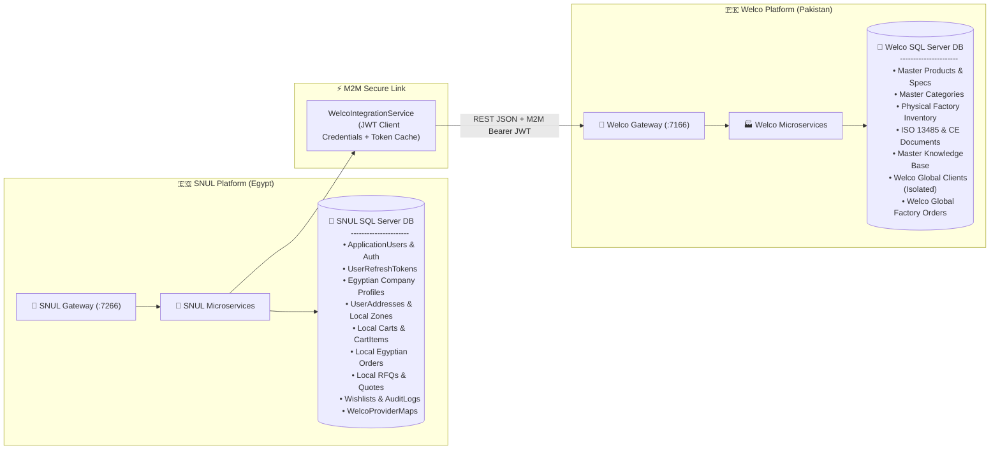
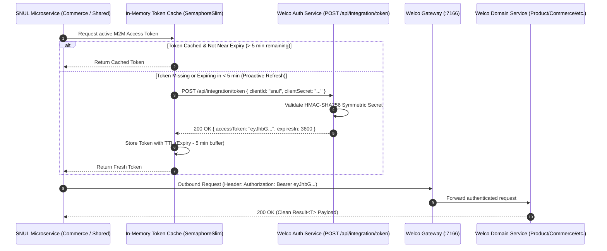
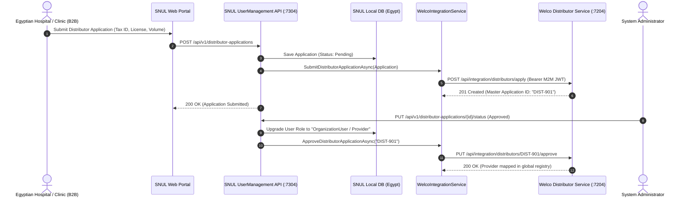
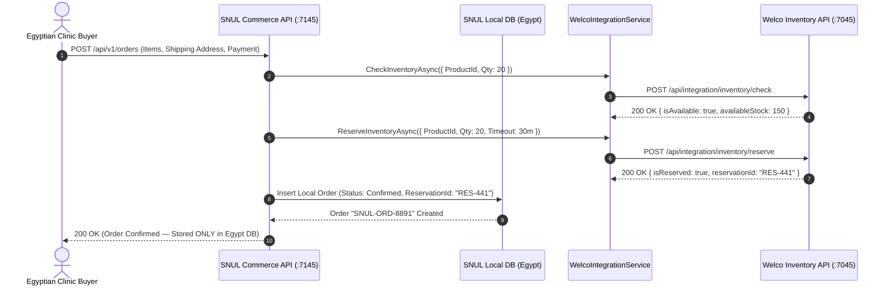

# 🏥 SNUL & WELCO Dual-Platform Architecture & Complete API Specification

> **Comprehensive System Documentation, Route Directory, Request/Response DTO Contracts, External M2M Integration Protocols, and Multi-Environment Infrastructure Guide.**
>
> Sourced directly from **Welco Surgical Instruments Platform** (Sialkot, Pakistan — Founded 1994, Master Manufacturing & Physical Warehouse Source) and operating **SNUL Platform** (Cairo, Egypt — Regional Healthcare Distribution Hub) with **strictly isolated client databases, local order books, and zero-duplication catalog architecture**.
>
> Built on **.NET 10**, **Clean / Onion Architecture**, **CQRS (MediatR)**, and **Ocelot API Gateway**.

---

## 📑 Table of Contents

1. [🌍 Dual-Platform Business & Geographic Topology](#1--dual-platform-business--geographic-topology)
2. [👥 Unified Role Hierarchy & Access Matrix](#2--unified-role-hierarchy--access-matrix)
3. [🛡️ Strict Data Isolation vs. Shared Integration Boundaries](#3-️-strict-data-isolation-vs-shared-integration-boundaries)
4. [🔒 External M2M Authentication & Token Lifecycle Engine](#4--external-m2m-authentication--token-lifecycle-engine)
5. [🌐 Multi-Environment Infrastructure (Dev / Test / Prod)](#5--multi-environment-infrastructure-dev--test--prod)
6. [📡 Complete API Route & Contract Catalog (SNUL & Welco)](#6--complete-api-route--contract-catalog-snul--welco)
   - [6.1 Auth Service (`/api/v1/auth`, `/api/integration/token`)](#61-auth-service-apiv1auth-apiintegrationtoken)
   - [6.2 User Management Service (`/api/v1/users`, `/companies`, `/addresses`, `/distributor-applications`)](#62-user-management-service-apiv1users-companies-addresses-distributor-applications)
   - [6.3 Product Catalog Service (`/api/v1/products`, `/categories`, `/currencies`, `/wishlists`)](#63-product-catalog-service-apiv1products-categories-currencies-wishlists)
   - [6.4 Commerce Service (`/api/v1/carts`, `/orders`, `/api/v1/integration/*`)](#64-commerce-service-apiv1carts-orders-apiv1integration)
   - [6.5 Sales Service (`/api/v1/rfqs`, `/quotes`, `/product-inquiries`)](#65-sales-service-apiv1rfqs-quotes-product-inquiries)
   - [6.6 Content & Support Service (`/api/v1/support-tickets`, `/documents`, `/faq`, `/help-articles`)](#66-content--support-service-apiv1support-tickets-documents-faq-help-articles)
   - [6.7 Certification Service (`/api/v1/certifications`)](#67-certification-service-apiv1certifications)
   - [6.8 Attachment Storage Service (`/api/v1/attachments`)](#68-attachment-storage-service-apiv1attachments)
7. [⚡ Welco Upstream Integration Endpoints (`/api/integration/*`)](#7--welco-upstream-integration-endpoints-apiintegration)
8. [🔄 Complete Business Workflows & Sequence Diagrams](#8--complete-business-workflows--sequence-diagrams)
9. [⚙️ Environment Configuration Files Schema (`appsettings.*.json` & `ocelot.*.json`)](#9-️-environment-configuration-files-schema-appsettingsjson--ocelotjson)
10. [🚀 Build, Verification, & Local Startup Guide](#10--build-verification--local-startup-guide)

---

## 1. 🌍 Dual-Platform Business & Geographic Topology

```
┌──────────────────────────────────────────────────────────────────────────────────┐
│                             WELCO (Pakistan - Master Hub)                        │
│  - Physical Manufacturing Facility (Founded 1994, Sialkot, Pakistan)             │
│  - Master Inventory Warehouse & Physical Stock Control                           │
│  - Master Surgical Catalog, Dimensions, Alloys, ISO 13485 & CE Proofs            │
│  - Welco Global Clients Database (Strictly Isolated)                             │
└────────────────────────────────────────┬─────────────────────────────────────────┘
                                         │ Machine-to-Machine Integration (JWT)
                                         │ Sourced Dynamically (Zero Duplication)
┌────────────────────────────────────────▼─────────────────────────────────────────┐
│                              SNUL (Egypt - Distribution Hub)                     │
│  - Regional Medical Devices & Surgical Instruments Distribution Platform         │
│  - Egyptian Hospitals, Clinics, and Regional B2B Buyers                          │
│  - Egyptian Clients, Carts, Orders, RFQs & Quotes Database (Strictly Isolated)   │
│  - Sourced Catalog, Live Inventory Checks, Upstream Support & Application Sync   │
└──────────────────────────────────────────────────────────────────────────────────┘
```

1. **Welco Platform (Pakistan — Origin of Production & Master Data):**
   - Headquartered with manufacturing facilities in Sialkot, Pakistan.
   - Holds the physical warehouse inventory and master product technical specifications (dimensions, titanium/stainless steel grades, ISO 13485 / CE certifications).
   - Operates as the **Single Source of Truth** for presentational catalog items, global certifications, real-time factory warehouse inventory, and global help knowledge base.
   - Maintains an isolated database for global direct clients and factory-direct orders.

2. **SNUL Platform (Egypt — Regional Commercial Hub):**
   - The dedicated digital distribution and sales platform serving Egypt and regional healthcare markets.
   - Maintains an independent, strictly isolated **SNUL Database** containing Egyptian customers, clinics, hospitals, user authentication credentials, shopping carts, localized orders, RFQs, delivery addresses, and audit trails.
   - Eliminates catalog duplication by dynamically sourcing catalog items, categories, certifications, and live inventory verification from Welco via high-performance, resilient API integration.

---

## 2. 👥 Unified Role Hierarchy & Access Matrix

Both platforms share an identical, synchronized role model:

| Unified Role | Platform Identifier | Description & Access Scope |
| :--- | :--- | :--- |
| **Admin** | `Admin` | System Administrator with unrestricted access to all endpoints, configuration, tenant verification, and audit logs. |
| **Staff** | `SnulStaff` (SNUL) / `WelcoStaff` (Welco) | Internal operations staff managing catalog moderation, order fulfillment, quote pricing, and customer support. |
| **Provider / Distributor** | `Provider` = `Distributor` = `OrganizationUser` | B2B healthcare accounts (hospitals, surgical centers, clinics, medical device distributors). Access to wholesale pricing, RFQs, itemized quotes, and bulk checkout. |
| **Client / Customer** | `Client` = `Customer` = `Guest` | Retail buyers, medical students, individual practitioners, and anonymous catalog browsers. Access to direct cart purchases and public catalog. |

---

## 3. 🛡️ Strict Data Isolation vs. Shared Integration Boundaries

To guarantee regulatory compliance, commercial security, and clean separation between local client relationships and upstream manufacturing:



### Isolation Boundary Rules:
- **Strictly Isolated in SNUL DB:**
  - Client credentials, hashed passwords, refresh tokens, and OTP codes.
  - Egyptian clinic and hospital company profiles, tax IDs, and local shipping addresses.
  - Active shopping cart sessions and guest tokens.
  - Local sales orders, invoices, payment transaction logs, and customer wishlists.
  - Local RFQ and quote negotiation cycles.
- **Shared / Sourced Dynamically from Welco:**
  - Surgical instrument catalog, product SKUs, variant attributes, and technical datasheets.
  - Category taxonomies and navigation trees.
  - Real-time physical warehouse stock checks and stock reservations.
  - Regulatory certifications (ISO 13485, CE Marking 93/42/EEC, FDA listings).
  - Global help articles, technical user guides, and FAQs.
  - Master distributor application synchronization.

---

## 4. 🔒 External M2M Authentication & Token Lifecycle Engine

Inter-system communication between SNUL and Welco is secured via an enterprise Machine-to-Machine (M2M) OAuth2-style Client Credentials token mechanism.



### Key Security & Reliability Invariants:
1. **Thread-Safe Token Caching:** Handled via `SemaphoreSlim(1, 1)` in `WelcoIntegrationService` to eliminate duplicate concurrent auth handshakes.
2. **Proactive 5-Minute Buffer Renewal:** The client automatically refreshes the token 5 minutes before the actual JWT expiry to eliminate mid-flight 401s.
3. **Multi-Market System Resolver:** `WelcoSystemResolver` supports multi-tenant target systems (`snul` for Egypt, `welo` for Saudi) with distinct BaseUrls and Credentials.
4. **Resilience & Retry Policies:** Configured with Polly exponential backoff (3 retries) and 30-second circuit timeouts.

---

## 5. 🌐 Multi-Environment Infrastructure (Dev / Test / Prod)

Both SNUL and Welco support **three complete environments**:

| Dimension | 1. Development (Local) | 2. Test (Hosted Staging) | 3. Production (Hosted Live) |
| :--- | :--- | :--- | :--- |
| **Hosting Platform** | `localhost` (Kestrel .NET 10) | `runasp.net` Staging Cluster | `runasp.net` / Enterprise Cloud |
| **SNUL Gateway URL** | `https://localhost:7266` / `http://localhost:5393` | `https://snul-gateway.runasp.net` | `https://snul.runasp.net` / `https://api.snul.com` |
| **Welco Gateway URL**| `https://localhost:7166` / `http://localhost:5293` | `https://welco-gateway.runasp.net`| `https://welco.runasp.net` / `https://api.welco.com` |
| **SQL Database** | Local SQL Server (`SNUL_Egypt_Db` / `Welco_Db`) | Hosted Shared SQL Server (Test) | Dedicated High-Availability SQL Server |
| **Certificate Trust**| Self-Signed Dev Certs (`DangerousAcceptAnyServerCertificateValidator: true` in Ocelot) | SSL Verified | Strict CA SSL Verified |
| **File Storage** | Local Disk (`wwwroot/uploads`) | Staging Volume Storage | CDN / Cloud Object Storage |

### Port Allocation Matrix (Development Mode):

| Microservice | SNUL Port (HTTPS) | Welco Port (HTTPS) | Primary Responsibility |
| :--- | :---: | :---: | :--- |
| **API Gateway (Ocelot)** | `7266` (`5393` HTTP) | `7166` (`5293` HTTP) | Reverse proxy, rate limiting, OpenAPI docs |
| **Auth Service** | `7303` | `7203` | Identity, JWT, OTP, M2M Tokens |
| **User Management** | `7304` | `7204` | Users, Companies, Addresses, Applications |
| **Product Catalog** | `7154` | `7054` | Master products, categories, currencies |
| **Commerce Service** | `7145` | `7045` | Carts, Orders, Inventory Check & Reservation |
| **Sales Service** | `7146` | `7046` | B2B RFQs, Quotes, Product Inquiries |
| **Content & Support**| `7147` | `7047` | Support tickets, Help articles, FAQs |
| **Certification** | `7201` | `7101` | Regulatory compliance (ISO 13485, CE) |
| **Attachment Storage**| `7280` | `7180` | Multi-format file storage & streaming |

---

## 6. 📡 Complete API Route & Contract Catalog (SNUL & Welco)

All API responses follow the standard `Result<T>` envelope:

```json
{
  "succeeded": true,
  "data": { ... },
  "message": "Operation completed successfully.",
  "errors": []
}
```

---

### 6.1 Auth Service (`/api/v1/auth`, `/api/integration/token`)
**Base Routes:** `https://localhost:7266/api/v1/auth` (SNUL) | `https://localhost:7166/api/v1/auth` (Welco)

#### 1. Register User / Client
- **Route:** `POST /api/v1/auth/register`
- **Access:** Anonymous
- **Request Form:**
```json
{
  "firstName": "Ahmed",
  "lastName": "Hassan",
  "email": "ahmed.hassan@cairo-clinic.eg",
  "password": "SecurePassword@123",
  "confirmPassword": "SecurePassword@123",
  "phoneNumber": "+201012345678",
  "userType": 1, // 0 = Client, 1 = OrganizationUser / Provider
  "companyName": "Cairo Surgical Clinic",
  "taxNumber": "EG-99887766",
  "commercialRegister": "CR-44332211"
}
```
- **Response Form:**
```json
{
  "succeeded": true,
  "data": {
    "userId": "3fa85f64-5717-4562-b3fc-2c963f66afa6",
    "email": "ahmed.hassan@cairo-clinic.eg",
    "requiresOtpVerification": true,
    "message": "Registration successful. Please verify your email with the OTP sent."
  },
  "message": null,
  "errors": []
}
```

#### 2. User Login
- **Route:** `POST /api/v1/auth/login`
- **Access:** Anonymous
- **Request Form:**
```json
{
  "email": "ahmed.hassan@cairo-clinic.eg",
  "password": "SecurePassword@123"
}
```
- **Response Form:**
```json
{
  "succeeded": true,
  "data": {
    "userId": "3fa85f64-5717-4562-b3fc-2c963f66afa6",
    "fullName": "Ahmed Hassan",
    "email": "ahmed.hassan@cairo-clinic.eg",
    "roles": ["OrganizationUser"],
    "accessToken": "eyJhbGciOiJIUzI1NiIsInR5cCI6IkpXVCJ9...",
    "refreshToken": "4c9d7890-a51c-4b3e-8c34-d102e3b4a567",
    "refreshTokenExpiryTime": "2026-09-21T12:00:00Z"
  },
  "message": null,
  "errors": []
}
```

#### 3. Verify Email OTP
- **Route:** `POST /api/v1/auth/verify-email-otp`
- **Access:** Anonymous
- **Request Form:**
```json
{
  "email": "ahmed.hassan@cairo-clinic.eg",
  "otp": "482910"
}
```
- **Response Form:**
```json
{
  "succeeded": true,
  "data": true,
  "message": "Email verified successfully.",
  "errors": []
}
```

#### 4. Resend Email OTP
- **Route:** `POST /api/v1/auth/resend-otp`
- **Access:** Anonymous
- **Request Form:** `{ "email": "ahmed.hassan@cairo-clinic.eg" }`
- **Response Form:** `Result<bool>`

#### 5. Refresh Token
- **Route:** `POST /api/v1/auth/refresh-token`
- **Access:** Anonymous / Authenticated
- **Request Form:**
```json
{
  "accessToken": "eyJhbG...",
  "refreshToken": "4c9d7890-a51c-4b3e-8c34-d102e3b4a567"
}
```
- **Response Form:** `Result<AuthResponseDto>`

#### 6. User Profile (Get & Update)
- **Routes:** `GET /api/v1/auth/profile` | `PUT /api/v1/auth/profile`
- **Access:** Authenticated
- **Request Form (PUT):**
```json
{
  "firstName": "Ahmed",
  "lastName": "Hassan",
  "phoneNumber": "+201012345678",
  "avatarUrl": "https://localhost:7280/api/v1/attachments/file/avatar-1.jpg"
}
```
- **Response Form:** `Result<UserProfileDto>`

#### 7. Issue M2M Integration Token
- **Route:** `POST /api/integration/token`
- **Access:** Machine / Anonymous (HMAC secret protected)
- **Request Form:**
```json
{
  "clientId": "snul",
  "clientSecret": "SNUL_SYMMETRIC_INTEGRATION_KEY_32_CHARS"
}
```
- **Response Form:**
```json
{
  "succeeded": true,
  "data": {
    "accessToken": "eyJhbGciOiJIUzI1NiIsInR5cCI6IkpXVCJ9...",
    "tokenType": "Bearer",
    "expiresIn": 3600
  },
  "message": null,
  "errors": []
}
```

---

### 6.2 User Management Service (`/api/v1/users`, `/companies`, `/addresses`, `/distributor-applications`)

#### 1. Distributor Applications (Local Onboarding & Upstream Sync)
- **Route:** `POST /api/v1/distributor-applications`
- **Access:** Anonymous / Authenticated
- **Request Form:**
```json
{
  "companyName": "Nile Surgical Specialties Co.",
  "contactPerson": "Dr. Tarek Mansour",
  "email": "tarek@nilesurgical.eg",
  "phone": "+201223344556",
  "countryId": "1a2b3c4d-0000-0000-0000-000000000001",
  "salesVolumeBand": "$100,000 - $500,000",
  "categoryInterest": "Cardiovascular & Neurosurgery",
  "website": "https://nilesurgical.eg",
  "sourceMarket": "Egypt"
}
```
- **Response Form:**
```json
{
  "succeeded": true,
  "data": {
    "id": "e9123456-1111-2222-3333-444455556666",
    "companyName": "Nile Surgical Specialties Co.",
    "status": "Pending",
    "createdAt": "2026-09-14T11:00:00Z"
  },
  "message": "Application submitted successfully and registered with master network.",
  "errors": []
}
```

#### 2. Get / Manage Distributor Applications
- **Routes:**
  - `GET /api/v1/distributor-applications` (Roles: `Admin`, `SnulStaff`)
  - `GET /api/v1/distributor-applications/{id}` (Roles: `Admin`, `SnulStaff`)
  - `PUT /api/v1/distributor-applications/{id}/status` (Roles: `Admin`)
- **Request Form (PUT Status):**
```json
{
  "status": "Approved", // Approved, Rejected, UnderReview
  "reviewNotes": "Commercial registration verified with Ministry of Health."
}
```

#### 3. Companies & Branches Management
- **Routes:** `GET /api/v1/companies`, `POST /api/v1/companies`, `GET /api/v1/companies/{id}`, `PUT /api/v1/companies/{id}`
- **Access:** `Admin`, `OrganizationUser`
- **Request Form (POST):**
```json
{
  "name": "Al-Amal Specialized Hospital",
  "taxNumber": "EG-123456789",
  "commercialRegister": "CR-987654",
  "phone": "+20223456789",
  "email": "procurement@alamal-hospital.eg",
  "isProvider": false
}
```

#### 4. Addresses & Location Hierarchy
- **Routes:**
  - `GET /api/v1/addresses` | `POST /api/v1/addresses` | `PUT /api/v1/addresses/{id}` | `DELETE /api/v1/addresses/{id}`
  - `GET /api/v1/countries` | `GET /api/v1/cities?countryId={id}` | `GET /api/v1/zones?cityId={id}`

---

### 6.3 Product Catalog Service (`/api/v1/products`, `/categories`, `/currencies`, `/wishlists`)

#### 1. Query Products
- **Route:** `GET /api/v1/products`
- **Access:** Public / Anonymous
- **Query Parameters:** `?pageNumber=1&pageSize=20&categoryId={guid}&searchTerm=forceps&minPrice=10&maxPrice=500&inStockOnly=true`
- **Response Form:**
```json
{
  "succeeded": true,
  "data": {
    "items": [
      {
        "id": "7b123456-a1b2-c3d4-e5f6-7a8b9c0d1e2f",
        "name": "Titanium Micro Forceps 18cm",
        "sku": "WLC-TF-18",
        "description": "High-precision titanium surgical forceps for neurovascular surgery.",
        "price": 145.00,
        "currency": "USD",
        "categoryId": "2c222222-3333-4444-5555-666677778888",
        "categoryName": "Micro Surgery",
        "imageUrl": "https://localhost:7280/api/v1/attachments/file/forceps.png",
        "isAvailable": true,
        "material": "Grade 5 Titanium",
        "specifications": {
          "Length": "180mm",
          "TipWidth": "0.3mm",
          "Autoclavable": "Yes"
        }
      }
    ],
    "pageNumber": 1,
    "pageSize": 20,
    "totalCount": 142,
    "totalPages": 8
  },
  "message": null,
  "errors": []
}
```

#### 2. Categories Taxonomy
- **Route:** `GET /api/v1/categories`
- **Access:** Public / Anonymous
- **Response Form:** `Result<List<CategoryDto>>` (Tree structure with children categories)

#### 3. Customer Wishlist
- **Routes:** `GET /api/v1/wishlists` | `POST /api/v1/wishlists/items` | `DELETE /api/v1/wishlists/items/{productId}`
- **Access:** Authenticated

---

### 6.4 Commerce Service (`/api/v1/carts`, `/orders`, `/api/v1/integration/*`)

#### 1. Cart Management
- **Routes:**
  - `GET /api/v1/carts` (Authenticated / Guest Token)
  - `POST /api/v1/carts/items`
  - `PUT /api/v1/carts/items/{itemId}`
  - `DELETE /api/v1/carts/items/{itemId}`
  - `POST /api/v1/carts/merge` (Merge anonymous guest cart into user account upon login)
- **Request Form (Add Item):**
```json
{
  "productId": "7b123456-a1b2-c3d4-e5f6-7a8b9c0d1e2f",
  "quantity": 10
}
```

#### 2. Order Checkout (Local Egyptian DB Order)
- **Route:** `POST /api/v1/orders`
- **Access:** Authenticated
- **Request Form:**
```json
{
  "shippingAddressId": "9f333333-4444-5555-6666-777788889999",
  "billingAddressId": "9f333333-4444-5555-6666-777788889999",
  "paymentMethod": "BankTransfer", // CreditCard, BankTransfer, CashOnDelivery, LetterOfCredit
  "notes": "Urgent delivery required for OR theater 3.",
  "items": [
    {
      "productId": "7b123456-a1b2-c3d4-e5f6-7a8b9c0d1e2f",
      "quantity": 10,
      "unitPrice": 145.00
    }
  ]
}
```
- **Response Form:**
```json
{
  "succeeded": true,
  "data": {
    "orderId": "SNUL-2026-09-00142",
    "orderStatus": "Confirmed",
    "totalAmount": 1450.00,
    "currency": "USD",
    "createdAt": "2026-09-14T11:15:00Z"
  },
  "message": "Order placed successfully in local Egyptian registry.",
  "errors": []
}
```

#### 3. Real-Time Pakistan Physical Inventory Check & Reserve
- **Route:** `POST /api/v1/integration/inventory/check`
- **Access:** Public / Authenticated
- **Request Form:**
```json
{
  "productId": "7b123456-a1b2-c3d4-e5f6-7a8b9c0d1e2f",
  "requestedQuantity": 50
}
```
- **Response Form:**
```json
{
  "succeeded": true,
  "data": {
    "productId": "7b123456-a1b2-c3d4-e5f6-7a8b9c0d1e2f",
    "isAvailable": true,
    "availableQuantity": 320,
    "warehouseLocation": "Sialkot Central Factory Warehouse"
  },
  "message": null,
  "errors": []
}
```
- **Route:** `POST /api/v1/integration/inventory/reserve`
- **Access:** Authenticated / Checkout
- **Request Form:**
```json
{
  "productId": "7b123456-a1b2-c3d4-e5f6-7a8b9c0d1e2f",
  "quantity": 50,
  "lockTimeoutMinutes": 30
}
```
- **Response Form:**
```json
{
  "succeeded": true,
  "data": {
    "reservationId": "res-99881122",
    "isReserved": true,
    "expiresAt": "2026-09-14T11:45:00Z"
  },
  "message": "Physical warehouse stock reserved.",
  "errors": []
}
```

---

### 6.5 Sales Service (`/api/v1/rfqs`, `/quotes`, `/product-inquiries`)

#### 1. Request for Quotation (RFQ)
- **Routes:**
  - `GET /api/v1/rfqs` (Roles: `Admin`, `SnulStaff`, `OrganizationUser`)
  - `GET /api/v1/rfqs/{id}` (Roles: `Admin`, `SnulStaff`, `OrganizationUser`)
  - `POST /api/v1/rfqs` (Roles: `Admin`, `SnulStaff`, `OrganizationUser`)
  - `PUT /api/v1/rfqs/{id}/status` (Roles: `Admin`, `SnulStaff`)
- **Request Form (POST RFQ):**
```json
{
  "title": "Tender: Cardiovascular Surgery Forceps & Clamps (500 sets)",
  "requiredDeliveryDate": "2026-12-01T00:00:00Z",
  "notes": "ISO 13485 test reports must be supplied with each kit.",
  "items": [
    {
      "productId": "7b123456-a1b2-c3d4-e5f6-7a8b9c0d1e2f",
      "targetQuantity": 500,
      "targetUnitPrice": 120.00
    }
  ]
}
```

#### 2. Itemized Quotes & Approval Pipeline
- **Routes:**
  - `GET /api/v1/quotes` | `GET /api/v1/quotes/{id}`
  - `POST /api/v1/quotes` (Roles: `Admin`, `SnulStaff`)
  - `POST /api/v1/quotes/{id}/approve` (Roles: `Admin`, `OrganizationUser`)
  - `POST /api/v1/quotes/{id}/decline` (Roles: `Admin`, `OrganizationUser`)
- **Request Form (POST Create Quote):**
```json
{
  "rfqId": "4a111111-2222-3333-4444-555566667777",
  "validUntil": "2026-10-15T00:00:00Z",
  "discountPercentage": 10.0,
  "shippingFee": 250.00,
  "items": [
    {
      "productId": "7b123456-a1b2-c3d4-e5f6-7a8b9c0d1e2f",
      "quantity": 500,
      "offeredUnitPrice": 125.00
    }
  ]
}
```

---

### 6.6 Content & Support Service (`/api/v1/support-tickets`, `/documents`, `/faq`, `/help-articles`)

#### 1. Support Tickets
- **Routes:** `GET /api/v1/support-tickets`, `POST /api/v1/support-tickets`, `POST /api/v1/support-tickets/{id}/reply`, `PUT /api/v1/support-tickets/{id}/status`
- **Request Form (Create Ticket):**
```json
{
  "subject": "Sterilization protocol clarification for Grade 5 Titanium Forceps",
  "category": "Technical",
  "priority": "High",
  "message": "Please provide steam autoclave temperature limits and chemical compatibility chart."
}
```

#### 2. Help Articles & Knowledge Base
- **Routes:** `GET /api/v1/help-articles`, `GET /api/v1/help-articles/{slug}`, `GET /api/v1/faq`

---

### 6.7 Certification Service (`/api/v1/certifications`)

- **Routes:** `GET /api/v1/certifications`, `GET /api/v1/certifications/{id}`
- **Response Form:**
```json
{
  "succeeded": true,
  "data": [
    {
      "id": "c1000000-0000-0000-0000-000000000001",
      "name": "ISO 13485:2016 Medical Devices QMS",
      "issuingAuthority": "TÜV SÜD Product Service GmbH",
      "certificateNumber": "Q5 092834 0004 Rev. 01",
      "issuedDate": "2024-01-15",
      "expiryDate": "2027-01-14",
      "documentUrl": "https://localhost:7280/api/v1/attachments/file/iso13485.pdf"
    },
    {
      "id": "c1000000-0000-0000-0000-000000000002",
      "name": "CE Marking (Directive 93/42/EEC on Medical Devices)",
      "issuingAuthority": "BSI Group The Netherlands B.V.",
      "certificateNumber": "CE 682910",
      "issuedDate": "2023-06-01",
      "expiryDate": "2028-05-31",
      "documentUrl": "https://localhost:7280/api/v1/attachments/file/ce_mark.pdf"
    }
  ],
  "message": null,
  "errors": []
}
```

---

### 6.8 Attachment Storage Service (`/api/v1/attachments`)

- **Upload:** `POST /api/v1/attachments/upload` (Multipart form with `file`)
- **Download / Stream:** `GET /api/v1/attachments/file/{fileName}` (Public file streaming)
- **Delete:** `DELETE /api/v1/attachments/{id}` (Roles: `Admin`, `SnulStaff`)

---

## 7. ⚡ Welco Upstream Integration Endpoints (`/api/integration/*`)

Exported by Welco's master microservices and consumed securely by SNUL's `WelcoIntegrationService`:

| Domain | Welco Controller | Upstream Route | HTTP Verb | Purpose |
| :--- | :--- | :--- | :---: | :--- |
| **Auth** | `IntegrationTokenController` | `/api/integration/token` | `POST` | Issues M2M JWT tokens for client credentials |
| **Products** | `IntegrationProductsController` | `/api/integration/products` | `GET` | Paginated master surgical instrument catalog |
| **Product Detail** | `IntegrationProductsController` | `/api/integration/products/{id}` | `GET` | Detailed specs, CAD dimensions, materials |
| **Categories** | `IntegrationProductsController` | `/api/integration/categories` | `GET` | Master taxonomy hierarchy |
| **Providers** | `IntegrationProductsController` | `/api/integration/providers` | `GET` | Active verified manufacturing suppliers |
| **Inventory Check** | `IntegrationInventoryController` | `/api/integration/inventory/check` | `POST` | Queries central Pakistan physical warehouse stock |
| **Inventory Reserve**| `IntegrationInventoryController` | `/api/integration/inventory/reserve`| `POST` | Locks stock in Pakistan warehouse for 30 min |
| **Distributors** | `IntegrationDistributorsController` | `/api/integration/distributors/apply`| `POST` | Registers regional distributor application in master DB |
| **Distributors** | `IntegrationDistributorsController` | `/api/integration/distributors` | `GET` | Lists distributor applications across all regions |
| **Distributor Ops** | `IntegrationDistributorsController` | `/api/integration/distributors/{id}/approve`| `PUT` | Approves distributor & grants global supplier map |
| **Distributor Ops** | `IntegrationDistributorsController` | `/api/integration/distributors/{id}/reject` | `PUT` | Rejects application with reason |
| **Support** | `IntegrationSupportController` | `/api/integration/support/tickets` | `GET` / `POST` | Syncs technical customer support tickets |
| **Support Thread** | `IntegrationSupportController` | `/api/integration/support/tickets/{id}/reply`| `POST` | Appends engineering response from factory |
| **Help Articles** | `IntegrationHelpController` | `/api/integration/help/articles` | `GET` | Technical instrument care and maintenance docs |
| **Help FAQs** | `IntegrationHelpController` | `/api/integration/help/faqs` | `GET` | Global knowledge base questions |
| **Certifications** | `IntegrationCertificationsController` | `/api/integration/certifications` | `GET` | Returns ISO 13485 / CE certificates & proofs |

---

## 8. 🔄 Complete Business Workflows & Sequence Diagrams

### Workflow 1: Distributor / Provider Registration & Upstream Synchronization



---

### Workflow 2: Direct Checkout with Real-Time Pakistan Physical Stock Reservation



---

## 9. ⚙️ Environment Configuration Files Schema (`appsettings.*.json` & `ocelot.*.json`)

### 1. SNUL Downstream Microservices `appsettings.json`

```json
{
  "Logging": {
    "LogLevel": {
      "Default": "Information",
      "Microsoft.AspNetCore": "Warning"
    }
  },
  "ConnectionStrings": {
    "DatabaseConnection": "Server=localhost;Database=SNUL_Egypt_Db;Trusted_Connection=True;TrustServerCertificate=True;"
  },
  "JwtSettings": {
    "Secret": "SNUL_SUPER_SECURE_JWT_SECRET_KEY_32_CHARS!",
    "Issuer": "https://localhost:7266",
    "Audience": "https://localhost:7266",
    "ExpiryMinutes": 60
  },
  "WelcoIntegration": {
    "BaseUrl": "https://localhost:7166",
    "ClientId": "snul",
    "ClientSecret": "WELCO_M2M_SYMMETRIC_SHARED_SECRET_KEY",
    "DefaultSystem": "snul",
    "TimeoutSeconds": 30,
    "RetryCount": 3,
    "Systems": {
      "snul": {
        "BaseUrl": "https://localhost:7166",
        "ClientId": "snul",
        "ClientSecret": "WELCO_M2M_SYMMETRIC_SHARED_SECRET_KEY",
        "Market": "Egypt",
        "TimeoutSeconds": 30
      },
      "welo": {
        "BaseUrl": "https://welco-gateway.runasp.net",
        "ClientId": "welo",
        "ClientSecret": "WELO_M2M_SYMMETRIC_SHARED_SECRET_KEY",
        "Market": "Saudi",
        "TimeoutSeconds": 45
      }
    }
  }
}
```

### 2. Ocelot Gateway Configuration Schema (`ocelot.commerce.Development.json`)

```json
{
  "Routes": [
    {
      "DownstreamPathTemplate": "/api/v1/carts",
      "DownstreamScheme": "https",
      "DownstreamHostAndPorts": [
        { "Host": "localhost", "Port": 7145 }
      ],
      "UpstreamPathTemplate": "/api/v1/carts",
      "UpstreamHttpMethod": [ "GET", "POST", "PUT", "DELETE" ],
      "DangerousAcceptAnyServerCertificateValidator": true
    },
    {
      "DownstreamPathTemplate": "/api/v1/orders",
      "DownstreamScheme": "https",
      "DownstreamHostAndPorts": [
        { "Host": "localhost", "Port": 7145 }
      ],
      "UpstreamPathTemplate": "/api/v1/orders",
      "UpstreamHttpMethod": [ "GET", "POST", "PUT" ],
      "DangerousAcceptAnyServerCertificateValidator": true
    },
    {
      "DownstreamPathTemplate": "/api/v1/integration/{everything}",
      "DownstreamScheme": "https",
      "DownstreamHostAndPorts": [
        { "Host": "localhost", "Port": 7145 }
      ],
      "UpstreamPathTemplate": "/api/v1/integration/{everything}",
      "UpstreamHttpMethod": [ "GET", "POST", "PUT", "DELETE" ],
      "DangerousAcceptAnyServerCertificateValidator": true
    }
  ]
}
```

---

## 10. 🚀 Build, Verification, & Local Startup Guide

### 1. Build Verification
Both solutions are compiled and verified on **.NET 10.0**:

```bash
# Build SNUL Solution
dotnet build "E:\SNUL Site\backend\SNUL\SNUL.slnx"
# Result: Build succeeded. 0 Warning(s), 0 Error(s).

# Build Welco Solution
dotnet build "E:\welco site\Welco\Welco.sln"
# Result: Build succeeded. 0 Warning(s), 0 Error(s).
```

### 2. Run Test Suites
```bash
# Run SNUL Tests
dotnet test "E:\SNUL Site\backend\SNUL\SNUL.Shared.Tests\SNUL.Shared.Tests.csproj"
# Passed: 30, Failed: 0.

# Run Welco Tests
dotnet test "E:\welco site\Welco\Welco.Tests\Welco.Tests.csproj"
# Passed: 29, Failed: 0.
```

### 3. Startup Profiles
- **SNUL Gateway Interactive Docs:** `https://localhost:7266/scalar/v1`
- **Welco Gateway Interactive Docs:** `https://localhost:7166/scalar/v1`
- **Aggregated Raw OpenAPI:** `https://localhost:7266/openapi/all.json`

---

*SNUL & WELCO Dual-Platform Architecture © 2026. All rights reserved.*
